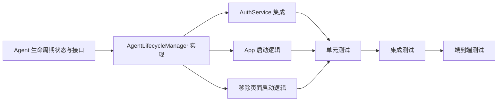

# 产品功能图

> 项目：remote-control
> 更新时间：2026-03-31
> 状态： agent-lifecycle 阶段规划中

## 功能树

```
remote-control
├── 共享会话 [模块] ✅
│   ├── 📋 S001 Session 状态模型
│   ├── 🔗 S002 双端共控主链路
│   └── 🚀 S003 发布与部署
│
├── 服务端 [模块] ✅
│   ├── 📋 B001 服务端扩展共享会话状态模型
│   ├── 🔗 B002 服务端支持多终端视图双向转发
│   ├── 🎯 B003 Agent 单 PTY 会话管理
│   ├── 🔐 B004 Agent 登录配置与会话恢复
│   ├── 📊 B005 会话归属校验
│   ├── 📱 B006 服务端设备注册与在线状态模型
│   ├── 📊 B007 服务端 terminal 状态模型与设备上限
│   ├── 🔌 B008 设备列表与 terminal 列表/创建 API
│   ├── 🔄 B009 按 terminal_id 的 WebSocket 附着与在线 gating
│   ├── 🛑 B010 断线原因与 grace period 生命周期状态机
│   ├── 🔌 B011 Agent 端 terminal 级 relay
│   ├── 📊 B012 服务端权威在线态与实时视图数
│   ├── 🔄 B013 Agent 在线稳定性与 create_failed
│   ├── 🚪 B014 服务端创建准入与公开配置收口
│   ├── 🔌 B016 服务端离线即清理 terminal 活跃态
│   └── 🔄 B017 首个 terminal 创建与离线恢复链回归
│
├── Agent [模块] ✅
│   ├── 🎯 B011 Agent 多 terminal runtime
│   ├── 🔧 B018 AgentSupervisor 与优雅停机
│   ├── 🧹 B032 PTY 进程组清理
│   ├── ⏱️ B033 PTY 超时强制终止
│   ├── 🧼 B034 PTY 资源清理完整性
│   └── 🧪 B035 PTY 进程组清理集成测试
│
├── Flutter 客户端 [模块] ✅
│   ├── 📱 F001 Flutter 共享终端核心
│   ├── 🖥️ F002 桌面端本地终端窗口
│   ├── 📲 F003 移动端双端共控交互
│   ├── ⌨️ F004 移动端输入修复
│   ├── 👆 F005 TUI 选项触摸选择支持
│   ├── ✨ F006 移动端体验优化
│   ├── ⌨️ F007 终端快捷键动作模型
│   ├── ⌨️ F008 软键盘快捷键栏
│   ├── ⌨️ F009 统一快捷项模型
│   ├── ⌨️ F010 Claude 默认命令包
│   ├── ⌨️ F011 当前项目快捷命令
│   ├── ⌨️ F012 Claude Code 导航语义校准
│   ├── 🎨 F013 主题模式切换
│   ├── 🎨 F014 移动端命令面板与终端主题抛光
│   ├── 🔌 F015 设备/terminal 选择状态
│   ├── 🔌 F016 设备/terminal 选择 UI
│   ├── 📊 F017 客户端状态文案与刷新
│   ├── 🖥️ F018 terminal workspace tabs
│   ├── 🚪 F019 主入口重构与旧页降级
│   ├── 🔧 F020 workspace 创建/关闭交互
│   ├── 🖥️ F021 顶部状态栏与 terminal 菜单面板
│   ├── 🖥️ F022 tabs 交互降级与菜单主路径回归
│   ├── 📊 F023 客户端离线展示与 terminal 可用性对齐
│   ├── 🔧 F024 桌面端后台运行开关
│   └── 🔧 F025 桌面端退出生命周期
│
└── Agent 生命周期管理 [模块] 🆕
    ├── 📋 S024 Agent 生命周期状态与接口
    ├── 🔄 F032 AgentLifecycleManager 实现
    ├── 🔐 F033 AuthService 集成 AgentLifecycleManager
    ├── 🚀 F034 App 启动逻辑恢复 Agent
    ├── 🗑️ F035 移除页面级 Agent 启动逻辑
    ├── 🧪 F036 单元测试：AgentLifecycleManager
    ├── 🧪 F037 集成测试：登录登出与 Agent 生命周期
    └── 🧪 F038 端到端测试：完整生命周期验证
│
└── 日志集成 [模块] ✅
    ├── 📋 B043 Server 接入 log-service-sdk
    ├── 📋 B044 Server 请求日志中间件
    ├── 📋 B045 Server 结构化日志
    ├── 📋 B046 Server 转发 Client 日志到 log-service
    ├── 📋 B047 Agent 接入 log-service-sdk
    ├── 🚀 S028 Docker 标准化部署
    └── 🧪 S029 端到端验证
```

## 依赖图



## 模块依赖关系

| 模块 | 上游依赖 | 下游影响 |
|------|----------|----------|
| 共享会话 | 无 | 服务端、Flutter 客户端 |
| 服务端 | 共享会话 | Agent、Flutter 客户端 |
| Agent | 服务端 | Flutter 客户端（桌面端） |
| Flutter 客户端 | 共享会话、服务端、Agent | 无 |
| **Agent 生命周期管理** | **DesktopAgentSupervisor、DesktopAgentManager** | **AuthService、App 启动** |

## 关键路径

### 登录路径
```
App 启动
  ↓
检查登录状态
  ├── 未登录 → 显示登录页
  │              ↓
  │          登录成功
  │              ↓
  │          F033: AuthService 集成 → F032: AgentLifecycleManager.onLoginSuccess()
  │                                      ↓
  │                                  桌面端启动 Agent
  │
  └── 已登录 → F034: App 启动逻辑恢复 Agent
                      ↓
              F032: AgentLifecycleManager.onAppStart()
                      ↓
              检查 Agent 状态
                ├── 未运行 → 启动 Agent
                └── 已运行（当前用户） → 复用
                └── 已运行（非当前用户） → 关闭 + 新建
```

### 登出路径
```
用户点击退出登录
  ↓
F033: AuthService.logout()
  ↓
F032: AgentLifecycleManager.onLogout()
  ↓
始终关闭 Agent（无论谁启动的）
  ↓
清除本地 token
  ↓
回到登录页
```

### 关闭应用路径
```
用户关闭 App
  ↓
检查 keepAgentRunningInBackground 开关
  ├── true → Agent 继续运行
  │            （手机端可继续访问）
  │
  └── false → F032: AgentLifecycleManager.onAppClose()
                        ↓
                    关闭 Agent
```

## 统计

| 模块 | 总任务 | 完成 | 进度 |
|------|--------|------|------|
| 共享会话 | 3 | 3 | 100% |
| 服务端 | 17 | 17 | 100% |
| Agent | 6 | 6 | 100% |
| Flutter 客户端 | 25 | 25 | 100% |
| 日志集成 | 7 | 7 | 100% |
| **Agent 生命周期管理** | **8** | **0** | **0%** |
| **合计** | **66** | **58** | **87.9%** |

## 优先级分布

| 优先级 | 数量 | 功能 |
|--------|------|------|
| P0 | 0 | - |
| P1 | 0 | - |
| P2 | 8 | Agent 生命周期管理全部任务 |

## 缺陷回流记录

| Session | 缺陷 / 变更 | 修复任务 | 状态 |
|---------|-------------|----------|------|
| S007 | 手机端无法发送消息 | F004 | ✅ |
| S007 | 手机端中文输入失败 | F004 | ✅ |
| S007 | TUI 无法触摸选择 | F005 | ✅ |
| S008 | 移动端缺少系统化快捷键层 | F007, F008 | ✅ |
| S009 | 快捷项体系与 Claude 导航语义不足 | F009, F010, F011, F012 | ✅ |
| S010 | 命令面板交互、主题切换与浅色终端可读性不足 | F013, F014 | ✅ |
| S011 | 需要支持单 Agent 多 terminal，在线 gating 和关闭语义 | S011, B006-B011, F015-F016, S012 | ✅ |
| S012 | 电脑在线语义混乱、数量展示漂移、close 后 create 不稳定 | S013, B012, B013, F017 | ✅ |
| S014 | 设备与 terminal 选择页不再适合作为主入口，需要收敛为 terminal workspace tabs | S014, F018, F019 | ✅ |
| S015 | 创建条件需要收敛为"电脑在线 + 未达上限"，桌面端首个 terminal 要先恢复 Agent，closed terminal 不应保留活动连接记录 | S015, B014, B015, F020 | ✅ |
| S016 | 顶部 tabs 占用过多终端内容空间，需收敛为状态图标 + 当前 terminal 标题 + 菜单主路径 | S016, F021, F022 | ✅ |
| S017 | 电脑离线后 terminal 仍被视为活动对象，需统一收口为不可用/关闭状态，并清理活动连接痕迹 | S017, B016, B017, F023 | ✅ |
| S018 | 桌面端需要从普通 client 收敛为本机 Agent 控制台，并支持"退出后是否后台运行 Agent"的开关与安全停机语义 | S018, B018, F024, F025 | ✅ |
| S019 | 桌面 Agent 启动链和工作台状态仍带补丁式拼接，需拆成正式 Agent 管理子系统与单一状态机 | S019, B019, F026, F027 | ✅ |
| S022 | PTY 关闭时只杀死直接子进程，可能留下孤儿进程；缺少超时强制终止；资源清理可能不完整 | B032, B033, B034, B035 | ✅ |
| **S024** | **Agent 启动逻辑在页面 initState 中，退出登录时不关闭 Agent，需要重构为 App 级别统一管理** | **S024, F032-F038** | **⬜** |
