# 功能结构图

> 项目：remote-control
> 更新时间：2026-03-30
> 状态：✅ Agent 终端管理系统性重构已完成，桌面 Agent 后台模式已实现

## 系统架构

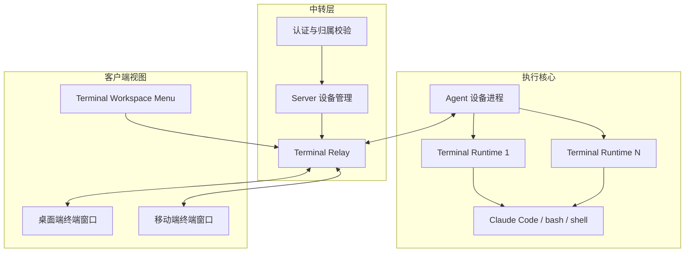

## 模块详情

### 1. 设备执行核心

#### 1.1 单 Agent 多 Terminal

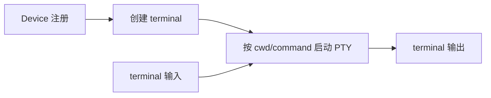

功能点：
- 单设备单 Agent
- 多 terminal runtime
- `cwd / command / env / title`
- terminal 生命周期与关闭原因

### 2. 服务端中转

#### 2.1 设备与 terminal 管理

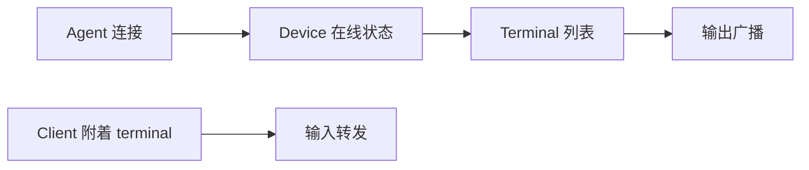

功能点：
- 在线 device 列表
- terminal 列表与创建
- device online gating
- terminal 级 relay 与 presence
- grace period 与关闭原因

### 3. 客户端视图

#### 3.1 Terminal Workspace 主入口

功能点：
- 登录后直达 terminal workspace
- 最近活跃 terminal 默认进入
- 顶部状态栏与菜单切换/新建
- 离线/关闭空态与错误恢复
- 初始化先拉后端快照

#### 3.1.2 顶部状态栏瘦身（已规划）

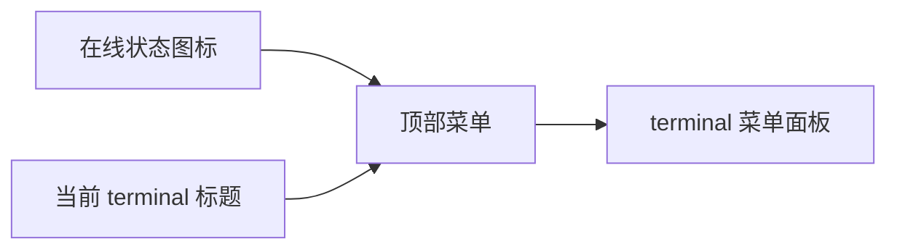

功能点：
- 顶部只保留在线状态图标、当前 terminal 标题和菜单入口
- `新建/切换/重命名/关闭 terminal` 收纳到菜单
- 优先释放终端内容区垂直空间

#### 3.1.1 创建与关闭语义收口（已完成）

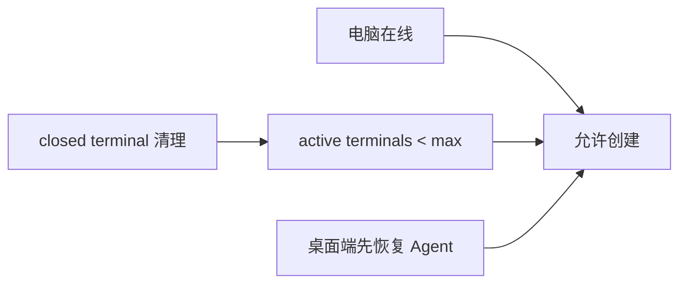

功能点：
- 创建 terminal 的前置准入只看“电脑在线 + 未达上限”
- 桌面端首个 terminal 在 Agent 离线时先恢复 Agent
- `closed terminal` 不再维持活动连接记录

#### 3.1.3 设备离线后的 terminal 收口（已完成）

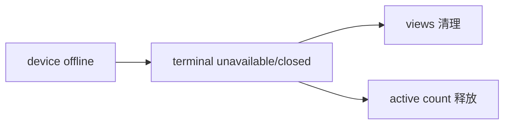

功能点：
- 设备离线后 terminal 不再继续以 attached/detached 活动态暴露
- `closed/unavailable terminal` 不再维持活动连接记录
- create 准入仍只看”电脑在线 + 未达上限”

**实现位置：**
- Server: `ws_agent.py` - `_expire_stale_agent()`, `bulk_update_session_terminals()`
- Server: `session.py` - `_close_expired_detached_terminals()`

#### 3.1.4 桌面 Agent 后台模式（已完成）

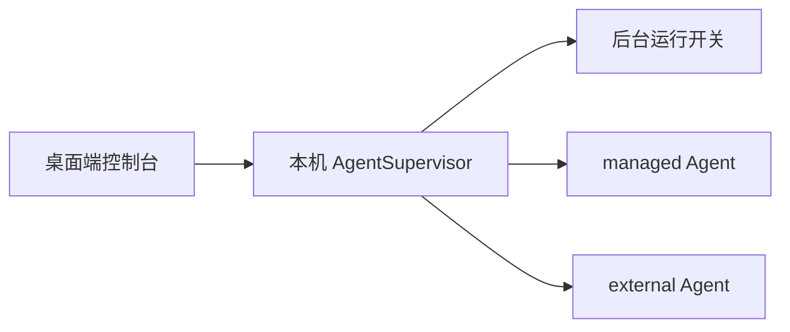

功能点：
- 桌面端作为本机 Agent 控制台，而不是普通 remote client
- 本地提供”退出桌面端后是否保持 Agent 后台运行”开关
- 区分桌面端自己拉起的 Agent 与外部已存在的 Agent
- 退出桌面端时按开关和 Agent 所有权决定是否停止 Agent

**实现位置：**
- Flutter: `desktop_agent_supervisor.dart` - DesktopAgentSupervisor
- Flutter: `desktop_agent_manager.dart` - DesktopAgentManager
- Flutter: `desktop_workspace_controller.dart` - keepAgentRunningInBackground 开关
- Flutter: `terminal_workspace_screen.dart` - 后台运行开关 UI

#### 3.1.5 Agent 本地 HTTP Supervisor（已完成）

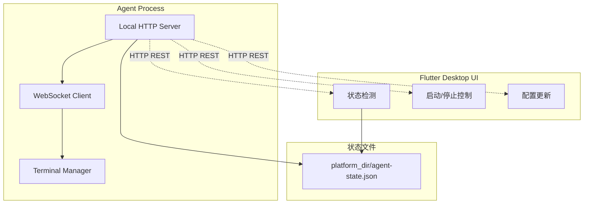

功能点：
- Agent 启动时同时启动本地 HTTP Server（端口 18765-18769）
- 提供 `/health`, `/status`, `/stop`, `/config`, `/terminals` 端点
- Flutter UI 通过 HTTP 与 Agent 通信
- 状态文件使用平台标准目录，记录实际端口和 PID

**实现位置：**
- Agent: `local_server.py` - LocalServer 类，端口 18765-18769
- Agent: `websocket_client.py` - `_start_local_server()`, `_stop_local_server()`
- Flutter: `desktop_agent_http_client.dart` - DesktopAgentHttpClient
- Flutter: `desktop_agent_supervisor.dart` - `_tryHttpStop()`, HTTP 发现与控制

#### 3.1.6 Claude 智能终端进入编排（已规划）

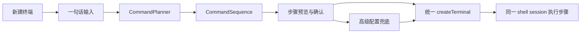

功能点：
- 在进入 terminal 前提供 Claude 智能入口，减少手机端输入成本
- 智能输出统一为 `CommandSequence`，不再以 `TerminalLaunchPlan` 作为主契约
- 用户在执行前能看到 `summary / provider / steps`，并显式确认
- 高级配置只做兜底和覆盖，不再承载独立的主创建路径
- runtime selection 与 workspace 两个入口共用同一 create + execute 主链路
- `CommandPlanner` 必须隔离 `claude -p` 等 provider 实现细节
- 命令步骤必须在同一个 shell session 中执行，失败时停止后续步骤

#### 3.1.7 桌面端与手机端行为差异（已完成）

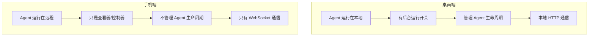

功能点：
- 桌面端：Agent 是本地进程，有完整生命周期管理
- 手机端：Agent 在远程设备，只负责查看和控制
- 后台运行开关只在桌面端显示
- 手机端退出不影响远程 Agent

**实现位置：**
- Flutter: `desktop_agent_supervisor.dart` - `supported` 属性（非 Android/iOS）
- Flutter: `terminal_workspace_screen.dart` - `controller.isDesktopPlatform` 条件渲染
- Flutter: 后台运行开关仅在 `desktopMode` 时显示

#### 3.1.8 Server 端 Agent 状态 TTL 机制（已完成）

功能点：
- Agent 状态 TTL = 90 秒
- 心跳刷新 TTL
- WebSocket 断开时不立即设置 offline，而是标记 stale
- TTL 过期后才真正设置为 offline
- 避免 Agent 重连过程中的状态抖动

**实现位置：**
- Server: `ws_agent.py:38` - `STALE_TTL_SECONDS = 90`
- Server: `ws_agent.py:29-31` - `stale_agents` 字典
- Server: `ws_agent.py:333-367` - `_mark_agent_stale()`, `_is_agent_stale()`, `_clear_agent_stale()`, `_expire_stale_agent()`
- Server: `ws_agent.py:395-412` - `_stale_agent_ttl_checker()` 后台任务

#### 3.2 终端视图

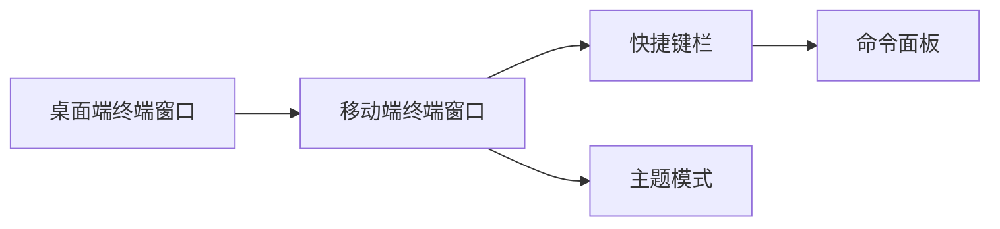

功能点：
- 同一 terminal 双端共控
- 移动端快捷项、命令面板、主题
- 桌面端硬件键盘输入
- mobile/desktop 数量以后端实时视图数为准

### 3.3 状态语义收口

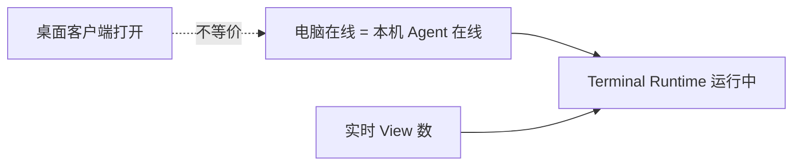

功能点：
- “电脑在线”只绑定本机 Agent 在线
- 桌面客户端打开不等于设备在线
- terminal `views` 以后端当前活跃连接数为权威
- 进入 terminal 页和返回列表页先查后端快照

## 数据流图

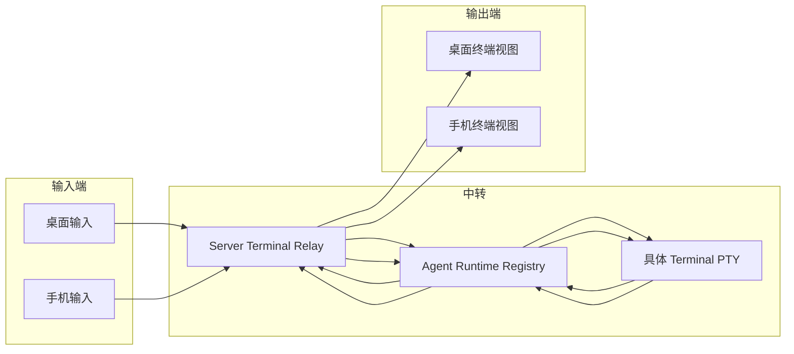

## 模块依赖关系

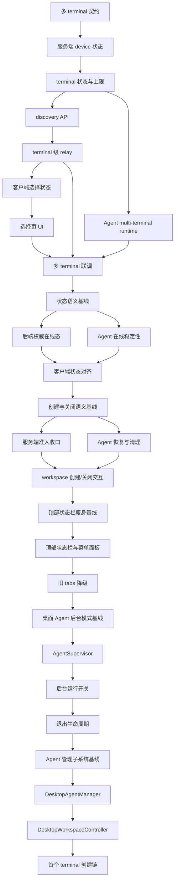

## 统计

| 模块 | 页面/能力数 | 状态 | 说明 |
|------|-------------|------|------|
| 设备执行核心 | 5 | ✅ 已完成 | device、runtime registry、PTY、输入、输出 |
| 中转层 | 5 | ✅ 已完成 | device 状态、terminal 状态、API、relay、关闭语义 |
| 客户端视图 | 8 | ✅ 已完成 | workspace、桌面终端、移动端终端、状态语义收口、创建与关闭语义、顶部状态栏瘦身、桌面 Agent 后台模式、桌面 Agent 管理子系统 |
| **合计** | **18** | ✅ | **面向多 terminal 共控、terminal workspace 主路径、创建/关闭语义、顶部状态栏瘦身、桌面 Agent 后台模式与桌面 Agent 管理子系统** |

## 已完成功能清单

| 功能 | 实现位置 | 完成状态 |
|------|----------|----------|
| 单 Agent 多 Terminal | `agent/app/websocket_client.py` - TerminalRuntimeManager | ✅ |
| PTY 封装 | `agent/app/pty_wrapper.py` - PTYWrapper | ✅ |
| Server 会话管理 | `server/app/session.py` - Redis 存储 | ✅ |
| Terminal Relay | `server/app/ws_agent.py`, `ws_client.py` | ✅ |
| Agent TTL 机制 (90s) | `server/app/ws_agent.py` - stale_agents | ✅ |
| Terminal Workspace | `client/lib/screens/terminal_workspace_screen.dart` | ✅ |
| 顶部状态栏瘦身 | `_WorkspaceHeaderBar` | ✅ |
| 创建/关闭语义收口 | `DesktopWorkspaceController` | ✅ |
| 桌面 Agent 后台模式 | `DesktopAgentSupervisor`, `DesktopAgentManager` | ✅ |
| Agent 本地 HTTP Server | `agent/local_server.py` - LocalServer | ✅ |
| 桌面/移动端行为差异 | `isDesktopPlatform` 条件渲染 | ✅ |
| 后台运行开关 | `keepAgentRunningInBackground` | ✅ |
| PTY 进程组清理 | `agent/app/pty_wrapper.py` - stop() | ✅ |
| 超时强制终止 | `agent/app/pty_wrapper.py` - SIGKILL | ✅ |
| 资源清理完整性 | `agent/app/pty_wrapper.py` - _cleanup() | ✅ |
| Terminal-bound Agent conversation | Server `agent_conversations/events` + Client assistant 投影 | ⬜ |

## 3.2 Terminal-bound Agent Conversation（规划中）

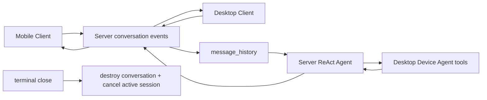

功能点：
- `user_id + device_id + terminal_id` 唯一绑定一个 active Agent conversation
- 手机端和桌面端共享同一事件投影，本地 history 只做渲染缓存
- Server 从 conversation events 重建 `message_history`，不依赖客户端拼接 prompt
- terminal close / device offline closed / logout 时销毁 conversation 并拒绝旧 respond/resume

**规划任务：**
- Shared: `S083` 契约与生命周期基线，`S084` 全链路验收
- Backend: `B085` 持久化，`B086` run/respond/resume 绑定，`B087` fetch/stream，`B088` message_history + close cleanup
- Client: `F101` 服务端投影接入，`F102` 双端同步 UI

#### 3.1.9 PTY 进程组清理与资源完整性（规划中）

功能点：
- 使用 `os.killpg()` 杀死整个进程组，避免孤儿进程
- 添加 3 秒超时机制，超时后发送 SIGKILL 强制终止
- 确保文件描述符、异步任务和内存资源完整清理
- 完善边界和异常场景的测试覆盖

**实现位置：**
- Agent: `agent/app/pty_wrapper.py` - PTYWrapper.stop()
- Tests: `agent/tests/test_pty_wrapper.py` - 进程组清理测试
